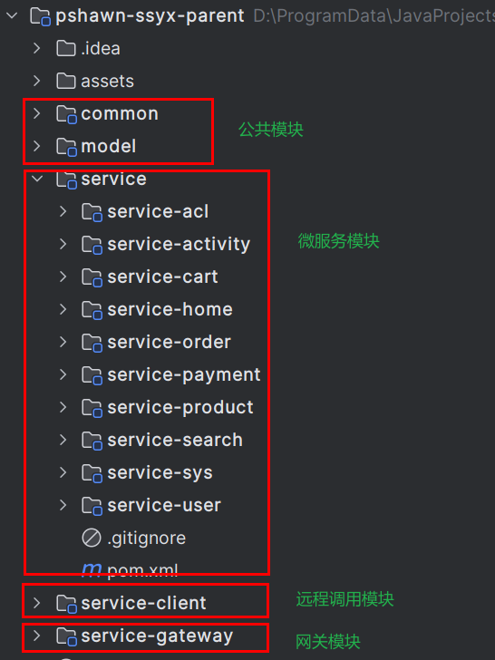
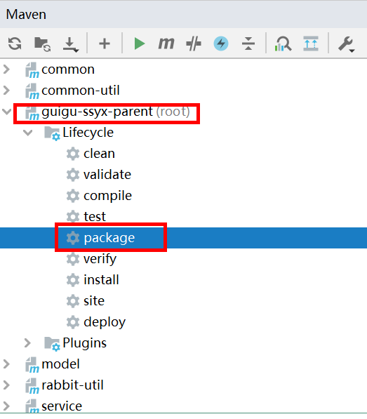
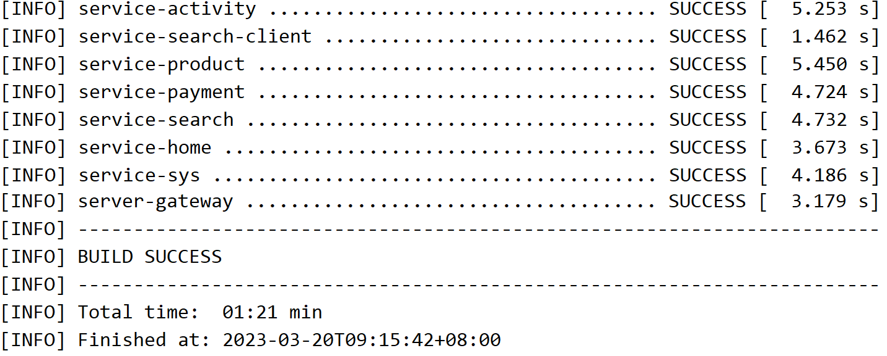
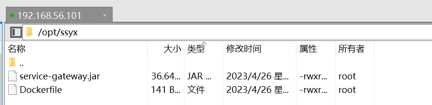
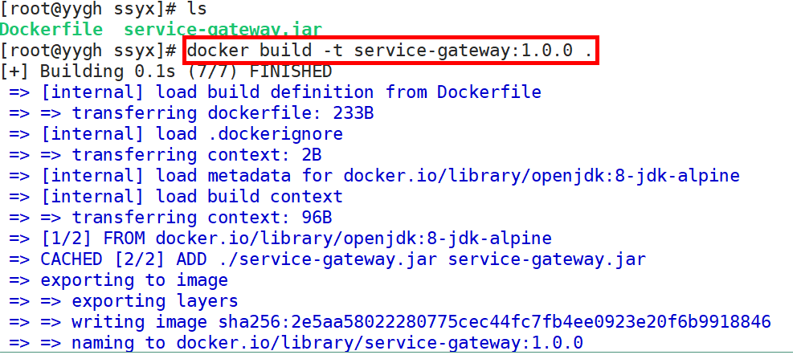
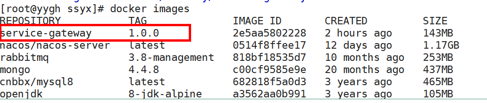
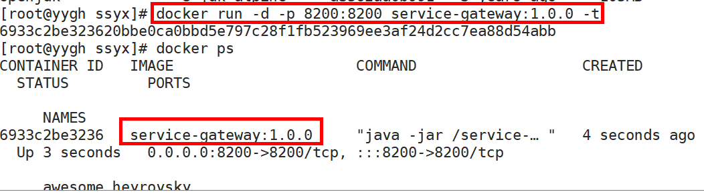
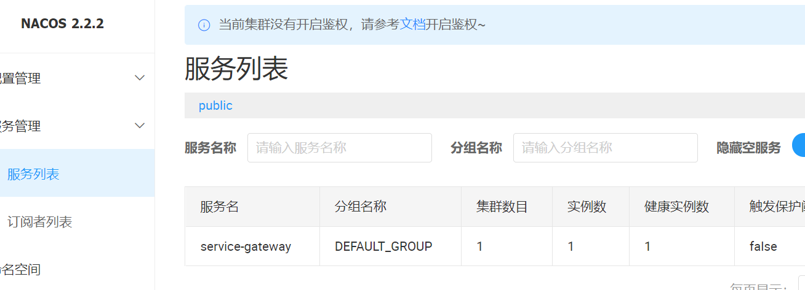

## Java团购微服务

### 1 项目介绍
Java微服务团购项目

#### 1.1 功能架构

**功能架构分为三层**

1、前台会员应用层

2、前台团长应用层

3、基础模块支撑层


#### 1.2 技术架构


#### 1.3 核心技术

SpringBoot：简化新Spring应用的初始搭建以及开发过程

SpringCloud：基于Spring Boot实现的云原生应用开发工具，SpringCloud使用的技术：（Spring Cloud Gateway、Spring Cloud OpenFeign、Spring Cloud Alibaba Nacos等）

MyBatis-Plus：持久层框架

Redis：缓存数据库

Redisson：基于redis的Java驻内存数据网格，实现分布式锁

RabbitMQ：消息中间件

ElasticSearch +Kibana: 全文检索服务器 +可视化数据监控

ThreadPoolExecutor：线程池来实现异步操作，提高效率

OSS：文件存储服务

Knife4j（Swagger）：Api接口文档工具

Nginx：负载均衡

MySQL：关系型数据库

微信支付

微信小程序

Docker：容器技术

DockerFile：管理Docker镜像命令文本


#### 1.4 项目模块

最终服务器端架构模块



pshawn-ssyx-parent：父工程，根目录，管理子模块：

	common：公共类父模块
	
		common-util：核心工具类
	
		service-util：service模块工具类
	
		rabbit-util：RabbitMQ工具类
	
	model：实体类模块
	
	service：系统微服务模块
	
	service-client：系统远程调用封装模块


### 2 后端项目部署-Docker

#### 2.1 安装运行环境

##### 2.1.1 安装JAVA 运行环境

```shell
# 第一步：上传或下载安装包
cd  /usr/local
jdk-8u152-linux-x64.tar.gz

# 第二步：解压安装包
tar -zxvf jdk-8u152-linux-x64.tar.gz

# 第三步：建立软连接
ln -s /usr/local/jdk1.8.0_152/  /usr/local/jdk

# 第四步：修改环境变量
vim /etc/profile

export JAVA_HOME=/usr/local/jdk
export JRE_HOME=$JAVA_HOME/jre
export CLASSPATH=.:$CLASSPATH:$JAVA_HOME/lib:$JRE_HOME/lib
export PATH=$PATH:$JAVA_HOME/bin:$JRE_HOME/bin

# 通过命令source /etc/profile让profile文件立即生效
source /etc/profile

# 第五步、测试是否安装成功
# 使用java -version，出现版本为java version "1.8.0_152"
java -version
```


##### 2.1.2 安装maven

```shell
# 第一步：上传或下载安装包
cd  /usr/local
apache-maven-3.6.1-bin.tar.gz

# 第二步：解压安装包
tar  -zxvf  apache-maven-3.6.1-bin.tar.gz

# 第三步：建立软连接
ln  -s  /usr/local/apache-maven-3.6.1/  /usr/local/maven

# 第四步：修改环境变量
vim /etc/profile

export MAVEN_HOME=/usr/local/maven
export PATH=$PATH:$MAVEN_HOME/bin

# 通过命令source /etc/profile让profile文件立即生效
source /etc/profile

# 第五步、测试是否安装成功
mvn -v
```


##### 2.1.3 安装Docker

```shell
# 环境安装：
yum -y install gcc-c++

# 第一步：安装必要的一些系统工具
yum install -y yum-utils device-mapper-persistent-data lvm2

# 第二步：添加软件源信息
yum-config-manager --add-repo http://mirrors.aliyun.com/docker-ce/linux/centos/docker-ce.repo

# 第三步：更新并安装Docker-CE
yum makecache fast
yum -y install docker-ce

# 第四步：开启Docker服务
service docker start
systemctl enable docker

# 第五步：测试是否安装成功
docker -v

# 第六步：配置镜像加速器
# 您可以通过修改daemon配置文件/etc/docker/daemon.json来使用加速器
mkdir -p /etc/docker
vim /etc/docker/daemon.json

{
 "registry-mirrors": ["https://registry.docker-cn.com"]
}

# 重启Docker生效
systemctl restart docker
```


##### 2.1.4 安装MySQL

```shell
# 第一步：拉取镜像
docker pull mysql:5.7

# 第二步：启动
docker run --name mysql --restart=always -v /home/ljaer/mysql:/var/lib/mysql -p 3306:3306 -e MYSQL_ROOT_PASSWORD=root -d mysql:5.7

# 第三步：测试mysql
# 进入容器：
docker exec -it sun_mysql /bin/bash

# 登录mysql：

mysql -u root -p 
root

# 如果顺利进入，安装成功
```


##### 2.1.5 安装RabbitMQ

```shell
# 第一步：拉取镜像
docker pull rabbitmq:management

# 第二步：启动
docker run -d -p 5672:5672 -p 15672:15672 --restart=always --name rabbitmq rabbitmq:management
```


##### 2.1.6 安装redis

```shell
# 第一步：拉取镜像
docker pull redis:latest

# 第二步：启动
docker run -d -p 6379:6379  --restart=always redis:latest redis-server
```


##### 2.1.7 安装nacos

```shell
# 第一步：拉取镜像
docker pull nacos/nacos-server

# 第二步：启动
docker run --env MODE=standalone --name nacos --restart=always -d -p 8848:8848 -e JVM_XMS=128m -e JVM_XMX=128m nacos/nacos-server
```


##### 2.1.8 安装Elasticsearch

```shell
# 第一步：拉取镜像
docker pull elasticsearch:7.8.0

# 第二步：启动
需要在宿主机建立：两个文件夹

mkdir -p /mydata/elasticsearch/plugins
mkdir -p /mydata/elasticsearch/data

# 授予权限chmod 777 /mydata/elasticsearch/data

docker run -p 9200:9200 -p 9300:9300 --name elasticsearch --restart=always \-e "discovery.type=single-node" \-e ES_JAVA_OPTS="-Xms512m -Xmx512m" \-v /mydata/elasticsearch/plugins:/usr/share/elasticsearch/plugins \-v /mydata/elasticsearch/data:/usr/share/elasticsearch/data \-d elasticsearch:7.8.0

# 第三步：安装中文分词器

# 1. 下载elasticsearch-analysis-ik-7.8.0.zip

# 2. 上传解压：unzip elasticsearch-analysis-ik-7.8.0.zip -d ik-analyzer

# 3. 上传到es容器：docker cp ./ik-analyzer a24eb9941759:/usr/share/elasticsearch/plugins

# 4. 重启es：docker restart a24eb9941759
# a24eb9941759：表示容器ID 运行时，需要改成自己的容器ID
```


####  2.2 Docker部署

**以service-gateway模块为例**

##### 2.2.1 修改代码和启动服务

**（1）修改项目配置文件Nacos、Redis、RabbitMQ、Elasticsearch等服务路径是虚拟机ip地址**

**（2）启动虚拟机中的Nacos、Redis、RabbitMQ、Elasticsearch等服务**


##### 2.2.2 项目打包






##### 2.2.3 制作Docker镜像

###### （1）编写Dockerfile文件

```dockerfile
FROM openjdk:8-jdk-alpine
VOLUME /tmp
ADD ./service-gateway.jar service-gateway.jar
ENTRYPOINT ["java","-jar","/service-gateway.jar", "&"]
```

###### （2）执行Docker命令

**把jar包和Dockerfile文件放到同一个目录下，**



**执行命令：docker build -t service-gateway:1.0.0 .**



**查看制作好的镜像**




##### 2.2.4 Docker容器启动

执行命令 **docker run -d -p 8200:8200 service-gateway:1.0.0 -t**



**访问测试：**

